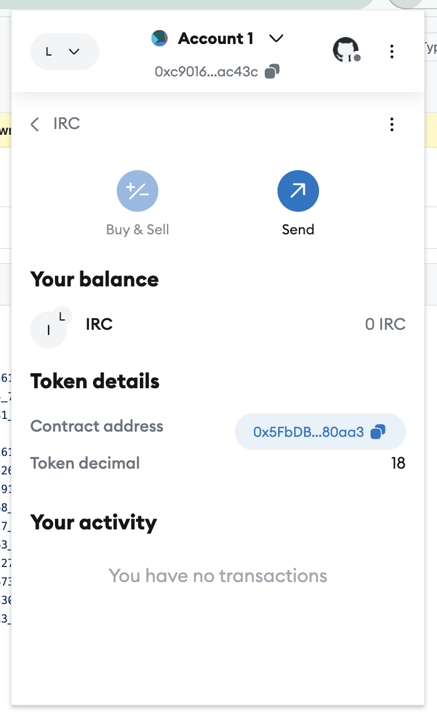

# Отчет 

Без лишний лирики, которая и так всем понятна, приступим:

#### Деплой СК:
```
	npx hardhat node
	npx hardhat run scripts/CoinsDeploy.js --network localhost
```

#### Вызов скриптов:
```
	npx hardhat run scripts/CommonActions.js --network localhost
	npx hardhat run scripts/BalanceChecker.js --network localhost
	npx hardhat run scripts/Filters.js --network localhost
	npx hardhat run scripts/StorageChecker.js --network localhost
```

#### Скрины




Выгрузить NFT не удалось, не смог разобраться с `tokenId` значением, перепробовал все что только можно, вызывал safeMint с конкретным значением, но так и не понял, что скрывается за этим идентификатором.

#### Вопросы и ответы:
1. Что такое функция approve и как она используется? 
   Функция `approve` позволяет владельцу токены разрешить другому юзеру (адресу) выполнять манипуляции с токеном - например, продажа или передача
2. В чем различие ERC721 и ERC1155?
   ERC721 - NFT стандарт, в котором каждый токен имеет уникальный идентификатор (тот самый проблемный `tokenId`), ERC1155 - более обширный формат, который помимо NFT так же поддерживает FT токены  
3. Что такое SBT токен?  
   Токен, который невозможно передать. Используется, например, для верификации (как галочки VK?)
4. Как можно сделать SBT токен?
   Запретить передачу токена, если говорить совсем просто, то оверрайднуть функцию transfer 

